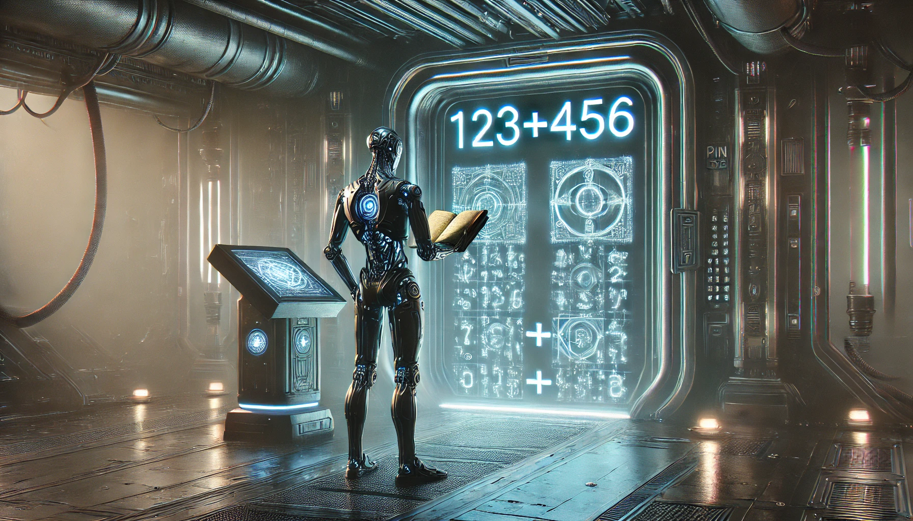

---

author: "v4nn4"
title: "Learning Addition with GPT"
date: "2025-01-11"
tags: ["gpt", "pytorch", "outlines", "llm"]
ShowToc: false
ShowBreadCrumbs: false
math: mathjax
images:
  - aliens.webp
---




Inspired by Andrej Karpathy's [nanoGPT](https://github.com/karpathy/nanoGPT) and his excellent YouTube series[^1], I decided to train my own transformer model on a simple dataset. Additionally, I aimed to calculate precisely how well the model performs. This is not trivial when working with text, as evaluations often rely on a so-called *vibe check*, which is inherently subjective.

A natural choice for objective evaluation is to train the model to generate text representing equations in the form $x + y = z$. Evaluating the model then becomes a straightforward task: checking the format and comparing both sides of the equations. While learning the format doesn't seem too challenging, learning addition itself is a daunting task.

I realized (a bit late) that Andrej proposed this as an exercise to the viewer in his video description:

> EX2: Train the GPT on your own dataset of choice! What other data could be fun to blabber on about? (A fun advanced suggestion if you like: train a GPT to do addition of two numbers, i.e. a+b=c. You may find it helpful to predict the digits of c in reverse order, as the typical addition algorithm (that you're hoping it learns) would proceed right to left too. You may want to modify the data loader to simply serve random problems and skip the generation of train.bin, val.bin. You may want to mask out the loss at the input positions of a+b that just specify the problem using y=-1 in the targets (see CrossEntropyLoss ignore_index). Does your Transformer learn to add? Once you have this, swole doge project: build a calculator clone in GPT, for all of +-*/. Not an easy problem. You may need Chain of Thought traces.)

Let's tackle the addition learning problem!

## The Problem

We are given text representing a list of equations in the form $x + y = z$, where $x$ and $y$ are two positive integers. To simplify the dataset, we’ll use 3-digit integers, resulting in 1 million unique equations. Each equation is written as follows:

```bash
001+001=0002
123+456=0579
```

Leading zeroes are included to maintain consistent positional encoding, which significantly enhances convergence. This representation eliminates the need for padding tokens during batch inference, as all equations are uniformly represented as arrays of size 12.

Here’s how the dataset is generated:

```python
digits = range(1000)
equations = [
    f"{a:03}+{b:03}={a+b:04}"
    for a, b in product(digits, repeat=2)
]
random.shuffle(equations)
split_index = int(ratio * len(equations))
train_set = equations[:split_index]
test_set = equations[split_index:]
```

We then split the `test_set` evenly into a validation set (used for loss monitoring) and a final test set. The vocabulary used is: `0123456789+=;`. The semicolon separates equations. The vocabulary size is noted as $V$.

## Naive solutions

Before diving into transformers, let’s explore simpler models.

### 2-gram model

The 2-gram (or bigram) model predicts the next token based solely on the previous token. This is achieved by examining all consecutive tokens in the dataset and counting their occurrences. The result is visualized as a $V \times V$ matrix:



We notice that `0` and `1` behave differently compared to other digits. For `0`, this relates to the padding we used. For `1`, the reason lies in the distribution of sums on the right-hand side: all sums exceeding a thousand begin with `1`. This skews the distribution, as the largest possible sum is `1998`.

If we follow the probability trail and constrain the model to output 4 digits, it will generate numbers between 900 and 999.

### Nearest neighbors model

The 2-gram model has very few parameters but fails to capture the complexity of addition. Let’s try using the entire training set at inference time instead.

For a given equation, we identify equations in the dataset that differ by only one digit. This approach should work if the dataset is properly shuffled and sufficiently large. For instance, given `123 + 456 = 579`, some *neighbors* might look like this:

```bash
122+456=0578
923+456=1379
123+450=0573
123+856=0979
```

There are at most $6 \times 9 = 54$ neighbors for each equation. By counting the occurrences of digits on the right-hand side of these equations, we compute the most likely first, second, and third digits.

This method becomes computationally intensive, so I tested it on only 100 equations. However, the proportion of accurate predictions, which I call exact score, converges quickly:



The results suggest that if we use 50% or more of the total dataset, this method yields near-perfect predictions. With smaller fractions, the model struggles to "learn" addition. Note that no real learning occurs here—the goal remains to compress the training set into a compact representation.

## Training a GPT

Next, we turn to a transformer model, specifically GPT-2, as implemented in TinyGPT.

As usual, we create `batch_size` batches of indices and targets by sliding a `block_size` window across the dataset. The transformer is then trained iteratively to predict the next token by minimizing the loss across all batches.

### A few tweaks

Before presenting the results, here are some adjustments I made to the original model:

- Every 1,000 iterations, I perform batch inference on the entire test set to predict addition results. My primary objective is achieving close to 100% accuracy on unseen data. The validation set is only used for monitoring loss versus training loss.
- I compute two metrics: 
  - *Approximative score*: Comparing the absolute difference between actual and expected values on the right-hand side.
  - *Exact score*: Counting the number of correctly predicted results.
- Following Andrej’s suggestion, I mask the loss everywhere except after the equal sign, focusing the model on critical predictions. Training without this masking significantly worsens performance.
- I used the [outlines](https://github.com/dottxt-ai/outlines) library and its `RegexLogitsProcessor` to constrain generation. For example, I enforced regex patterns to ensure only valid integers appear after the equal sign.
- Dropout was unnecessary for my model sizes. Also, `torch.compile` only works without dropout on `mps` devices (as of January 2025).

### Results

I experimented with varying model sizes by adjusting $d_{\textrm{model}}$ (embedding dimension), $N$ (number of layers), and $h$ (attention heads).

From the data I gathered in [Transformers Dashboard]( "Transformers Dashboard") I observed that:

- $h = N$ most of the time
- $d_{\textrm{model}} \gg N$
- $d_{\textrm{model}} = 2^p$

Following Andrej's advice of using powers of two throughout, we are not left with many options for our small experiment. I experimented with the following settings:

| Size | $d_{\textrm{model}}$ | $N$ | $h$ | Params |
|------|----------------------|-----|-----|--------|
| Small | 32 | 2 | 2 | 0.03M |
| Medium | 64 | 2 | 2 | 0.1M |
| Large | 128 | 2 | 2 | 0.4M |

More details on my training specs:

- Training set : 100k equations (10% of the actual dataset). The idea here is to crush the nearest neighbors model since we know it cannot go above a score of 50% in this case
- Test set : 450k equations (50% of 90%)
- Batch size : 32
- Block size : 120, which should yield around 9-10 examples per batch
- Learning rate : starts at 0.001, then uses `ReduceLROnPlateau` with patience of 5 and factor of 0.5
- Run on my Macbook Air, 8GB RAM, M2 chip using PyTorch 2.5.1

And finally some results:





## Observations

- The initial learning rate heavily influences convergence speed. I haven’t yet found a robust heuristic for scaling it with model size.
- The model continues to learn even though the loss appears to plateau, as observed with the medium-sized model. This is somewhat surprising to me, as the exact prediction task should align with the training objective when using loss masking.
- Using the approximative score for the learning rate scheduler was effective, as it’s smoother than the exact score. If the learning rate decreases too fast, the model gets stuck and stops learning.
- Small models are highly sensitive to random seeds, sometimes learning quickly, sometimes failing entirely.

## Final Thoughts

I spent far more time on this project than anticipated, but it was absolutely worth it! Huge thanks to [@karpathy](https://x.com/karpathy?lang=fr) for his amazing tutorials. Here’s what I’d like to explore next:

- Learn more about learning rate scheduling. The current nanogpt implementation (cosine with warmup) caught my attention.
- Research position encodings further. Addition is commutative, which makes absolute position encoding potentially suboptimal.
- Use [outlines](https://github.com/dottxt-ai/outlines) for constrained generation in future LLM projects.

Code available here : https://github.com/v4nn4/gpt-add.

That will be all for today 🙏.

[^1]: Let's build GPT: from scratch, in code, spelled out., Andrej Karpathy https://youtu.be/kCc8FmEb1nY?si=uyikSDeCxE2NZDHT