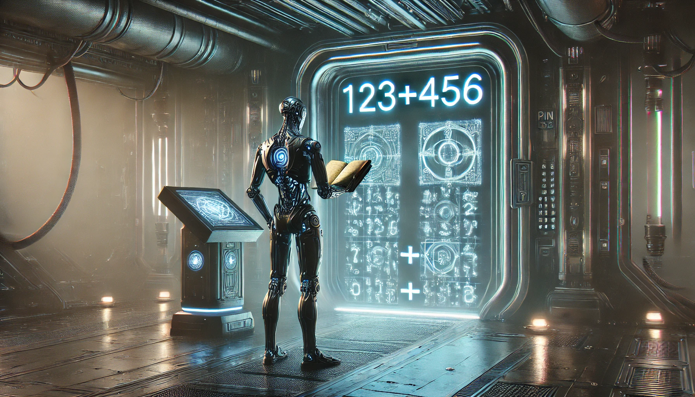

---

author: "v4nn4"
title: "Learning Addition with GPT"
date: "2024-07-06"
tags: ["gpt", "llm", "pytorch"]
ShowToc: false
ShowBreadCrumbs: false
math: mathjax
-------------




Inspired by Andrej Karpathy's [nanoGPT](https://github.com/karpathy/nanoGPT) and his great YouTube series[^1], I decided to train my own transformer on a simple dataset. Additionally, I wanted to calculate precisely how well the model would perform. This is not trivial when working with text, as it often relies on a so-called *vibe check*, which is inherently subjective.

A natural candidate for an objective evaluation is to train the model to generate text representing equations of the form $x+y=z$. Evaluating the model then comes down to checking the format and comparing both sides of the equations. While learning the format doesn't look too hard, learning addition itself seems like a daunting task.

I realized (a bit late) that Andrej proposed this as an exercise to the viewer in his video description:

> EX2: Train the GPT on your own dataset of choice! What other data could be fun to blabber on about? (A fun advanced suggestion if you like: train a GPT to do addition of two numbers, i.e. a+b=c. You may find it helpful to predict the digits of c in reverse order, as the typical addition algorithm (that you're hoping it learns) would proceed right to left too. You may want to modify the data loader to simply serve random problems and skip the generation of train.bin, val.bin. You may want to mask out the loss at the input positions of a+b that just specify the problem using y=-1 in the targets (see CrossEntropyLoss ignore_index). Does your Transformer learn to add? Once you have this, swole doge project: build a calculator clone in GPT, for all of +-*/. Not an easy problem. You may need Chain of Thought traces.)

Let's tackle the addition learning problem!

## The Problem

We are given a text representing a list of equations of the form $x+y=z$ with $x$ and $y$ two positive integers. We will choose 3-digit integers to have a dataset of 1 million equations. Equations will be written this way:

```bash
001+001=0002
123+456=0579
```

Leading zeroes are used to maintain consistent positional encoding, which significantly enhances convergence. This representation eliminates the need for padding tokens during batch inference, as all equations are uniformly represented as arrays of size 12.

Here is how our dataset is generated:

```python
digits = range(1000)
equations = [
    f"{a:03}+{b:03}={a+b:04}"
    for a, b in product(digits, repeat=2)
]
random.shuffle(equations)
split_index = int(ratio * len(equations))
train_set = equations[:split_index]
test_set = equations[split_index:]
```

We then divide 50/50 the `test_set` into a validation set used for validation loss monitoring, and our final test set. We use the following vocabulary: `0123456789+=;`. The semicolon will be used to separate equations. We will note the vocabulary size $V$.

## Naive solutions

Before exploring the world of transformers, let's start with simpler models.

### 2-gram model

The 2-gram (or bigram) model predicts the next token based solely on the previous token. This is achieved by examining all consecutive tokens in the dataset and counting their occurrences. The result can be shown in a $V \times V$ matrix:



We see that `0` and `1` have a different behavior versus other digits. For `0`, this has to do with the padding that we used. For `1`, the reason is that the digits of the sum on the right hand side are not homogeneously distributed. In particular, all sums higher than a thousand have a `1` as their first digit, which skews the distribution since our largest sum is `1998`.

If we follow the probability trail and constrain the model to output 4 digits, we see that this model will generate a number between 900 and 999.

### 1-nearest neighbor model

The previous model has very few parameters but fails to capture the complexity of addition. Let's try instead to use the entire train set at inference time.

For a given equation, we consider the equations in the dataset that differ only from one digit. This should be feasible if the dataset is properly shuffled and the train set is large enough. For instance if we consider 123+456=579, here are some such *neighbors*:

```bash
122+456=0578
923+456=1379
123+450=0573
123+856=0979
```


There are at most $6 \times 9 = 54$ neighbors found in the complete set for each equation. We count the occurences of digits in the right hand side of those equations to compute the most likely first digit, second digit, etc.

It gets pretty compute intensive, so I checked this prediction method for 100 equations only. However, the percentage of correct predictions seem to converge quickly.



What we see, is that if we work with 50% or more of the total set, this method will likely yield a perfect result. If we have access to a smaller fraction at training time, we won't be ab;e to properly learn addition. Note that no real learning is happening here.

The ultimate goal is to compress the information contained in the training set into a tiny internal representation.

## Training a GPT

We now turn to a transformer model, namely the GPT-2 model presnted in tinygpt.

As usual, we will create `batch_size` batches of indices and targets by sliding a window of size `block_size` across the dataset. We then iteratively train a transformer to predict the next token by minimizing the loss function across all batches.

### A few tweaks

Before I present some results, here are some tweaks that i made to the orignal model:

- Every thousand iterations, I use batch inference on the entire test set to predict the result of addition. My real objective is to be close to 100% correct prediction on the unseen data. The validation set is separated and only used for loss monitoring vs the training loss. I compute an *approximative score* by comparing the absolute value of actual and exepcted right hand side, and an *exact score* by counting the number of correctly predicted results
- As suggested by Andrej, I mask the loss everywhere except after the equal sign, which is where I want to model to focus on. I first tried without it and it definitely improves training by a large margin, allows smaller models to properly learn
- I am using the [outlines](https://github.com/dottxt-ai/outlines) library and their `RegexLogitsProcessor` to constrain the generation. Basically I want to ensure that only integers are found after the equal sign, using various regex patterns depending on whether I use leading zeroes or not, whether I use addition, multiplication, division, etc. This is only done at generation time. It requires to use a bit of the outlines API (tokenizer and a specific `generate` function).
- I found dropout to be useless for my model sizes. Also, `torch.compile` only works without dropout on `mps` devices (as of Jan 2025)
- The learning rate needs to be adjusted when changing the model size, especially the embedding dimension $d_{\textrm{model}}$. I modify it proportionally from a reference of $5 \times 10^{-3}$ for $d_{\textrm{model}}=128$ but there might be a better way to do this

### Results

I experimented with various model sizes by varying $d_{\textrm{model}}$ (embedding dimension), $N$ (number of layers) and $h$ (number of attention heads).

From the data I gathered in [Transformers Dashboard]( "Transformers Dashboard") I observed that:

- $h = N$ most of the time
- $d_{\textrm{model}} \gg N$
- $d_{\textrm{model}} = 2^p$

Following Andrej's advice of using powers of two throughout, we are not left with many options for our small experiment. I experimented with the following settings:

- Training set : 100k equations (10% of the actual dataset). The idea here is to crush the 1-nn model since we know it cannot go above a score of 50% in this case
- Test set : 450k equations (50% of 90%)
- Batch size : 32
- Block size : 120, which should yield around 9-10 examples per batch
- Learning rate : starts at 0.001, then uses `ReduceLROnPlateau` with patience of 5 and factor of 0.5
- Run on my Macbook Air, 8GB RAM, M2 chip using PyTorch 2.5.1

| Size | $d_{\textrm{model}}$ | $N$ | $h$ | Params | Loss < 0.9 | Loss @40k |  Score @40k|
|------|----------------------|-----|-----|----|--------|----------|----|-------|
| Small | 32 | 2 | 2 | 0.03M | 12k | 0.89 | 76% |
| Medium | 64 | 2 | 2 | 0.1M | 8k | 0.87 | 98% |
| Large | 128 | 2 | 2 | 0.4M | 6k | 0.88 | 98% |

0.8609 | 99%
0.8643 | 0.9200, lr 0.000125
0.8639 | 0.9500, lr 0.0005





## Observations

- The initial learning rate plays a big role in speeding convergence. I haven't found a good rule of thumb for changing it when increasing or decreasing model size
- Using the approximative score as a guide for the scheduler was a good call as it is smoother than the exact score. I used the `ReduceLROnPlateau` scheduler without too much thinking, and I see now that nanogpt used a custom [`get_lr`](https://github.com/karpathy/nanoGPT/blob/master/train.py#L231) function, so there is definitely something to study there
- Small models are dependent to the random seed, sometimes they learn quickly sometimes not at all. I trained an even smaller model with $d_{\textrm{model}} =32, N = h = 1$ to about 80% exact score, but not consistently. Having a single attention matrix would be great for visualization!

## Final Thoughts

I spent way too much time on this that I originally thought I would, but it was totally worth it! Huge thank you to Andrej for his amzing tutorials. Here are some of the things I would like to investigate next:

- Read some papers about learning rate scheduling. After seeing the nanogpt implementation (cosine with warmup), it seems my understanding was too basic
- Review litterature on position encodings. Addition is cmmmutative, which makes me think that the absolute position encoding might not be the best idea
- Use [outlines](https://github.com/dottxt-ai/outlines) for constrained generation in my next LLM project

That will be all for today 🙏.

[^1]: Let's build GPT: from scratch, in code, spelled out., Andrej Karpathy https://youtu.be/kCc8FmEb1nY?si=uyikSDeCxE2NZDHT