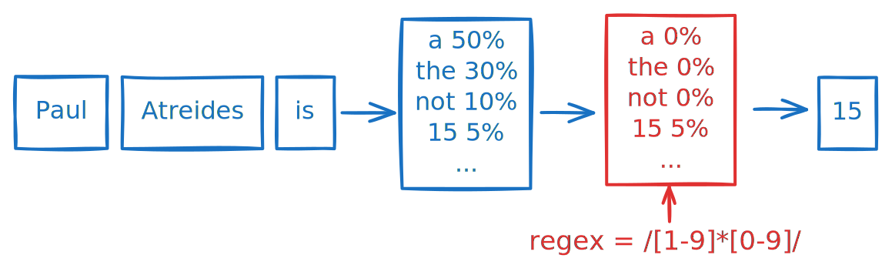
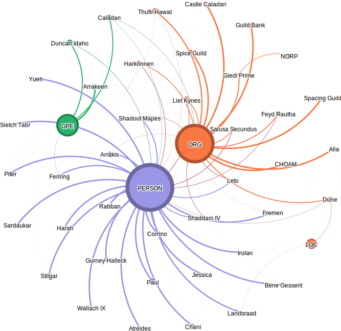
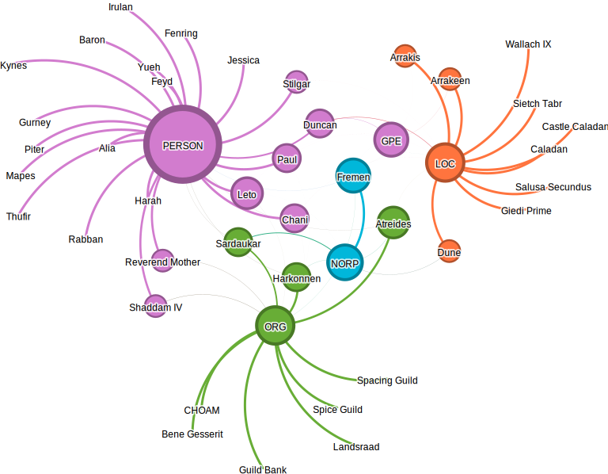
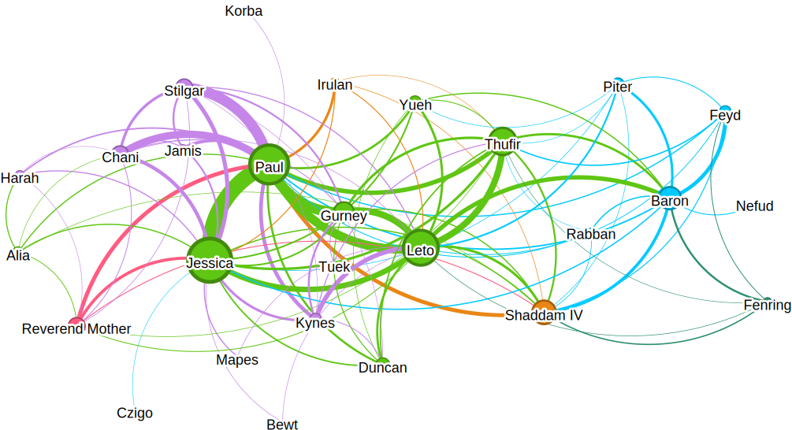

Structured generation is a method that enforces the output format of a language model. The idea is pretty smart and consists in representing the desired format (e.g. JSON) as a [Finite State Machine](https://en.wikipedia.org/wiki/Finite-state_machine) (FSM) and iteratively masking model probabilities to guide token generation.

In the following post, we will use the [outlines](https://github.com/dottxt-ai/outlines) library to perform Named Entity Recognition (NER) over the book [*Dune*](https://en.wikipedia.org/wiki/Dune_(novel)) by Frank Herbert. Our goal is to extract characters, locations, organizations, and hopefully be able to infer clusters from their interaction in the text. Let’s dive in!

# Data preparation

Our first step is to extract chunks of text. This step depends heavily on the source material and the task at hand. In our case, the dataset consists of text files for each chapter of the book, containing sentences and dialogues. We have two main goals:

1. **Semantic meaning**: We will use NER algorithms trained on chunks that have semantic meaning, so the chunks should be readable independently.
2. **Relationships**: We plan to link entities together if they appear close to each other in the text. Overlap is also desirable to avoid missing relationships due to unlucky chunking.

We parse sentences, accounting for dialogue quotes, using a regular expression and define a chunk as a group of 10 sentences, with an overlap of 2 sentences. Here's an example of how to achieve this in Python:

```python
import re

WINDOW_SIZE, OVERLAP = 10, 2
text = """
A beginning is the time for taking the most delicate care that the
balances are correct. This every sister of the Bene Gesserit knows. 
To begin your study of the life of Muad’Dib, then, take care that 
you first place him in his time: born in the 57th year of the 
Padishah Emperor, Shaddam IV...
"""
pattern = r'(?<!\w\.\w.)(?<![A-Z][a-z]\.)(?<![A-Z]\.)(?<=\.|!|\?)\s+(?=[A-Z"\'])'
sentences = [sentence.strip() for sentence in re.split(pattern, text)]
chunks = [
    ". ".join(sentences[i : i + WINDOW_SIZE])
    for i in range(0, len(sentences) - OVERLAP, WINDOW_SIZE - OVERLAP)
]
```

# Named Entity Recognition

A [Named Entity Recognition](https://en.wikipedia.org/wiki/Named-entity_recognition) (NER) model is a function that transforms a chunk of text into a list of labelled entities. Let's consider the following sentence:

> Paul Atreides is training at Castle Caladan, preparing for the challenges that lie ahead.

Such a model can tell that *Paul Atreides* is a person, and *Castle Caladan* a location. We can model the output in JSON format:

```json
{
    "entities": [
        {
            "name": "Paul Atreides",
            "label": "PERSON"
        },
        {
            "name": "Castle Caladan",
            "label": "LOC"
        }
    ]
}
```

We will use some of the labels defined in the [spaCy](https://github.com/explosion/spaCy) library:
  
| Entity Label | Description                                       |
|-------------|---------------------------------------------------|
| PERSON      | People, including fictional characters            |
| NORP        | Nationalities, religious groups, or political groups |
| ORG         | Organizations, companies, governments, etc.       |
| GPE         | Geo-political entities like countries, cities, or states |
| LOC         | Non-GPE locations, such as mountain ranges or bodies of water |

Let’s assume we have a function that produces this format for each chunk. Since an entity can appear multiple times with different labels depending on the context, we count the occurrences of each label, and the one with the highest probability is chosen.

Now we discuss two NER methods:
- Using a pre-trained model, here spaCy.
- Using structured generation with outlines (e.g., OpenAI GPT-4o-mini).

## Using pre-trained models

Before reinventing the wheel for fun, let's explore spaCy. spaCy is a popular Python library offering pre trained models for various NLP tasks.

Here’s how I extract entities from chunks using spaCy:

```python
from enum import Enum
from pydantic import BaseModel
import spacy

class Label(str, Enum):
    PERSON = "PERSON"
    NORP = "NORP"
    ORG = "ORG"
    GPE = "GPE"
    LOC = "LOC"

class Entity(BaseModel):
    name: str
    label: Label

class EntityList(BaseModel):
    entities: list[Entity]

nlp = spacy.load("en_core_web_lg")
labels_of_interest = [label.value for label in Label]

def generate_entities_spacy(chunk: str) -> EntityList:
    result = nlp(chunk)
    return EntityList(
        entities=[
            Entity(name=r.text, tag=r.label_)
            for r in result.ents
            if r.label_ in labels_of_interest
        ]
    )
```

Here’s an example of the output when run on the book's introduction:

---


<div class="entities" style="line-height: 2.5; direction: ltr">A beginning is the time for taking the most delicate care that the balances are correct. This every sister of the Bene Gesserit knows. To begin your study of the life of Muad'Dib, then, take care that you first place him in his time: born in the 57th year of the Padishah Emperor, 
<mark class="entity" style="background: #aa9cfc; padding: 0.45em 0.6em; margin: 0 0.25em; line-height: 1; border-radius: 0.35em;">
    Shaddam IV
    <span style="font-size: 0.8em; font-weight: bold; line-height: 1; border-radius: 0.35em; vertical-align: middle; margin-left: 0.5rem">PERSON</span>
</mark>
. And take the most special care that you locate Muad'Dib in his place: the planet 
<mark class="entity" style="background: #aa9cfc; padding: 0.45em 0.6em; margin: 0 0.25em; line-height: 1; border-radius: 0.35em;">
    Arrakis
    <span style="font-size: 0.8em; font-weight: bold; line-height: 1; border-radius: 0.35em; vertical-align: middle; margin-left: 0.5rem">PERSON</span>
</mark>
. Do not be deceived by the fact that he was born on 
<mark class="entity" style="background: #feca74; padding: 0.45em 0.6em; margin: 0 0.25em; line-height: 1; border-radius: 0.35em;">
    Caladan
    <span style="font-size: 0.8em; font-weight: bold; line-height: 1; border-radius: 0.35em; vertical-align: middle; margin-left: 0.5rem">GPE</span>
</mark>
 and lived his first fifteen years there. 
<mark class="entity" style="background: #aa9cfc; padding: 0.45em 0.6em; margin: 0 0.25em; line-height: 1; border-radius: 0.35em;">
    Arrakis
    <span style="font-size: 0.8em; font-weight: bold; line-height: 1; border-radius: 0.35em; vertical-align: middle; margin-left: 0.5rem">PERSON</span>
</mark>
, the planet known as 
<mark class="entity" style="background: #7aecec; padding: 0.45em 0.6em; margin: 0 0.25em; line-height: 1; border-radius: 0.35em;">
    Dune
    <span style="font-size: 0.8em; font-weight: bold; line-height: 1; border-radius: 0.35em; vertical-align: middle; margin-left: 0.5rem">ORG</span>
</mark>
, is forever his place. -from &quot;Manual of Muad'Dib&quot; by the Princess Irulan</div>


---

As you can see, *Arrakis* is labelled as a person, while *Bene Gesserit* and *Muad'Dib* and *Princess Irulan* are not labelled at all. I haven’t been able to get sensible results from their English pipeline, `en_core_web_lg`, which might be due to the fact that the text is fiction.

## Using structured generation

What exactly is structured generation, and how can we use it?

Language models is essentially a next-token prediction model. For instance, the sentence `Paul Atreides is` is most likely followed by the token `a`. The model is providing probabilities for each token, and we can see that that `the` or `not` are also plausible next tokens, though less likely.

With structured generation, our goal is to exclude certain tokens from being predicted entirely and guide the generation toward a predefined structure. In the example below, we are only interested in tokens representing numbers, such as Paul's age.



The output of language models is processed by setting the probabilities of certain tokens to zero, a technique also known as masking. To decide which tokens to mask, a Finite State Machine (FSM) is used to model the desired format. Such formats may include regular expressions, JSON schemas, programming language grammars, and more.

We will use a JSON schema as the output guide and deserialize it into an `EntityList` object. This can be done with outlines as follows:

```python
import outlines

@outlines.prompt
def extract_entities_prompt(chunk: str) -> str:
    """
    You are a world-class AI system trained to extract entities and part-of-speech tags from text.
    Given a text, you need to extract the entities and their corresponding tags.
    The tags can be one of the following:
    - PERSON (people, including fictional)
    - NORP (nationalities or religious or political groups)
    - ORG (organization, company, government, etc.)
    - GPE (geo-political entity, countries, cities, states)
    - LOC (non-GPE locations, mountain ranges, bodies of water)

    FORMAT: JSON, e.g. {"entities": [{"name": "John", "tag": "PERSON"}]}
    TEXT: {{ chunk }}
    RESULT:
    """

model - outlines.models.openai("gpt4o-mini")
generator = outlines.generator.json(model, EntityList)

def generate_entities_outlines(chunk: str) -> EntityList:
    return generator(chunk)
```

# Processing Results

We perform NER on all chunks and store the results in a dictionary.

```python
entities_per_chunk = {}
for i, chunk in enumerate(chunks):
    prompt = extract_entities_prompt(chunk)
    answer: EntityList = generator(prompt)
    entities_per_chunk[i] = answer.entities
```

To achieve better results (e.g., graphs), we aggregate name aliases. Inferring these aliases in an unsupervised way, especially in fictional content, would be quite complex, so we hardcode them.

```python
NAME_ALIASES = {
    "Paul": ["Paul Atreides", "Usul", ...],
    "Leto": ["the Duke", "Duke", "Duke Leto", ...],
    ...
}


def get_entity_name(name: str) -> str:
    name = name.strip()
    for base_name, aliases in NAME_ALIASES.items():
        if name in aliases:
            return base_name
    return name


entities_per_chunk = {
    chunk_id: [
        Entity(name=get_entity_name(entity.name), label=entity.label)
        for entity in entities
    ]
    for chunk_id, entities in entities_per_chunk.items
}
```

## Entity Labels Graph

An interesting way to visualize the NER results is to use a weighted undirected graph. An edge in the graph represents a connection between an entity (e.g., Paul) and a label (e.g., PERSON). We then use the [networkx](https://github.com/networkx/networkx) library to define edges in a `nx.Graph` object and export to a CSV file using `nx.write_edgelist`. This CSV file is then imported in [Gephi](https://github.com/gephi/gephi) for visualization.

In Gephi, we apply the following combination of layouts: ForceAtlas 2, Fruchterman Reingold, Label Adjust, and Noverlap. Additionally, we generate a modularity class (Statistics > Community Detection) to color labels and edges.

Below, we show the results when NER is performed using spaCy (with `en_core_web_lg`) and outlines with OpenAI's GPT-4o-mini model.

### spaCy



- There is significant mislabeling in this dataset. As mentioned earlier, this might be due to the training data being focused on non-fiction content.
- The `LOC` and `NORP` labels are largely ignored, with most entities being assigned to `PERSON`, `ORG` or `GPE`.

### outlines + GPT-4o-mini



- All characters are correctly labeled as `PERSON`, although some are occasionally misclassified as `ORG` or `LOC`. This highlights the importance of aggregation to reduce variance.
- The `GPE` and `NORP` labels are again mostly ignored, with entities often being categorized as `PERSON`, `ORG` or `LOC`.

## Social Graph

Finally, we disregard NER altogether and compute a simple social graph by creating an edge whenever two entities appear in the same chunk. We then focus exclusively on characters and use their respective houses (Atreides, Fremen, Harkonnen, etc.) to color labels and edges in Gephi.



Code available here : https://github.com/v4nn4/dune-ner

That’s all for today! 🌶️ 🪐